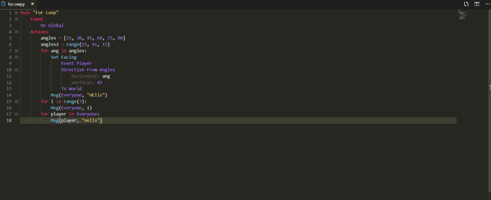

# OWScript VSCode Extension
This extension provides utilities for [OWScript](https://github.com/adapap/OWScript), a programming language for the Overwatch Workshop.

## Features
- Syntax Highlighting
- Compilation through context menu
- Clipboard support
- Error logging

Configure copy to clipboard with the following configuration:
* `owscript.clipboard`: copies the output to your clipboard
* WIP: `owscript.saveReload`: recompiles the code when the file is saved

[Extension Source](https://github.com/adapap/OWScript/tree/extension)